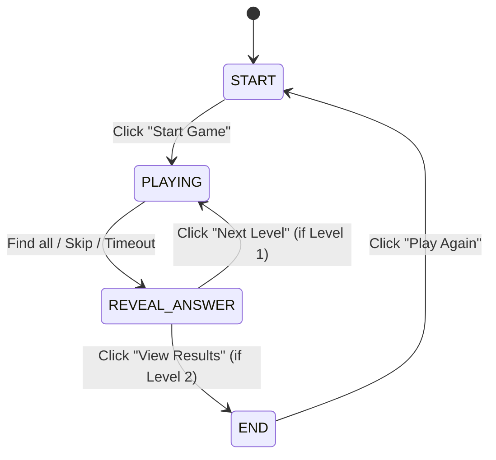

# Specification: Web Game Spot the Difference (จับผิดภาพ) - Version 2.0

**Date:** 2026-07-05
**Status:** Approved by User (Updated with Answer Reveal, Celebration SFX, and iPad Landscape support)
**Tech Stack:** HTML5, CSS3, Vanilla JavaScript (Single Page Application)

---

## 1. Overview & Purpose
A premium web-based "Spot the Difference" (จับผิดภาพ) game that runs entirely in the browser. Players are presented with two images side-by-side: an original reference image on the left, and a modified image on the right where certain elements have been deleted or altered. The objective is to identify and click all differences on the right image within a 3-minute time limit per level.

The game contains 2 levels based on the user's provided images:
- **Level 1 (Elephant Battle):** 7 differences.
- **Level 2 (Forest Boats):** 6 differences.

---

## 2. Project Architecture & File Structure
```text
spot-differences/
├── assets/                          # Game assets
│   ├── original_1.png               # Level 1: Original Image
│   ├── game_1.png                   # Level 1: Edited Image
│   ├── answer_1.png                 # Level 1: Answer Key (with blue circles)
│   ├── original_2.png               # Level 2: Original Image
│   ├── game_2.png                   # Level 2: Edited Image
│   ├── answer_2.png                 # Level 2: Answer Key (with blue circles)
│   └── applause.mp3                 # Victory applause sound effect
├── index.html                       # Core HTML shell (SPA container)
├── style.css                        # Premium visual style, responsive layout, animations
├── game.js                          # State management, coordinates checking, confetti canvas
├── .gitignore                       # Ignored folders (.superpowers, DS_Store, etc.)
└── README.md                        # Documentation
```

---

## 3. Game Flow & State Machine
The game manages four main screen states:



### A. Start Screen (หน้าแรก) - Premium Upgrade
- **Design:** Dark radial HSL background with an outer glowing aura on the glass card, featuring a pulsating, gradient-filled game title.
- **Preview Cards:** Shows two preview tiles side-by-side with thumbnail representations:
  - Level 1: "ด่านที่ 1: ยุทธหัตถี" (7 จุดต่าง)
  - Level 2: "ด่านที่ 2: วิถีชีวิตแม่น้ำ" (6 จุดต่าง)
- **Controls:** A primary "Start Game" button with scale transitions and shadow glow.

### B. Gameplay Screen (หน้าเล่นเกม) - Clean UI
- **Clean Images Workspace:** No floating text overlays ("ภาพต้นฉบับ" and "จับผิดจุดต่าง") on top of the images.
- **Clean Footer:** The helper tip text is removed from the bottom footer. Only the level skip button and a subtle credit are present.
- **Interaction:**
  - Left panel: Displays `original_X.png`. Non-interactive.
  - Right panel: Displays `game_X.png`. Hover displays crosshair cursor. Clicking checks click coordinate percentage coordinates against database coordinates.
  - Correct guess: Spawns glowing red outline circle `.diff-circle`.
  - Incorrect guess: Spawns scaling, fading red cross `.miss-indicator`, and shakes the workspace container `.shake-effect`.

### C. Answer Reveal Screen (หน้าจอแสดงเฉลยระหว่างด่าน)
- **Trigger:** Reached immediately when a level is completed (all points found, skip clicked, or timer runs out).
- **Interface:**
  - Header: Shows a success greeting in green: "ด่านที่ X เสร็จสิ้น (เฉลยจุดต่าง)".
  - Left panel: Displays `original_X.png`.
  - Right panel: Displays `answer_X.png` (which features the pre-drawn blue answer circles).
  - All clicked red circle overlays and miss markers are removed from the screen to show the clean answer image.
  - Footer: Displays a large green primary action button:
    - Level 1: "ไปด่านถัดไป (Next Level) ➔"
    - Level 2: "ดูคะแนนสรุป (View Results) ➔"
- **Celebration Effects:**
  - Plays the victory applause audio `assets/applause.mp3`.
  - Spawns a canvas-based falling confetti overlay (`#confetti-canvas`) dropping colorful particles from the top of the screen.

### D. End Screen (หน้าสรุปผล)
- **Statistics:** Shows total score (out of 13) and total remaining accumulated time bonus.
- **Controls:** A "Play Again" button that resets score, levels, timer variables, and returns to the Start Screen.

---

## 4. Layout Constraints for iPad Landscape & Desktop
To prevent vertical scrollbars on landscape viewports (e.g. iPad landscape at `1024x768px`):
- **Image Max Height:** The `.workspace` images container and wrapper are constrained to `max-height: 52vh` or `55vh`.
- **Fit Containment:** Image elements inside the wrappers use `width: auto; max-width: 100%; height: auto; max-height: 52vh; object-fit: contain;`. This forces side-by-side images to scale down automatically if the viewport height is short.
- **Compact Paddings:** Margin and paddings for the header and footer scale down on landscape aspect ratios using custom media queries, keeping the entire game board within a single viewport.

---

## 5. Confetti System & Web Audio Details
- **Confetti:** Written as a lightweight particle simulation drawing to a full-screen, pointer-events-disabled `<canvas id="confetti-canvas">` element. Particles feature realistic falling speeds, rotation, gravity, and randomized colors.
- **Applause Sound:** Audio is loaded dynamically from `assets/applause.mp3` using standard HTML5 Audio, playing when the `REVEAL_ANSWER` state is loaded and pausing when the user transitions away.
