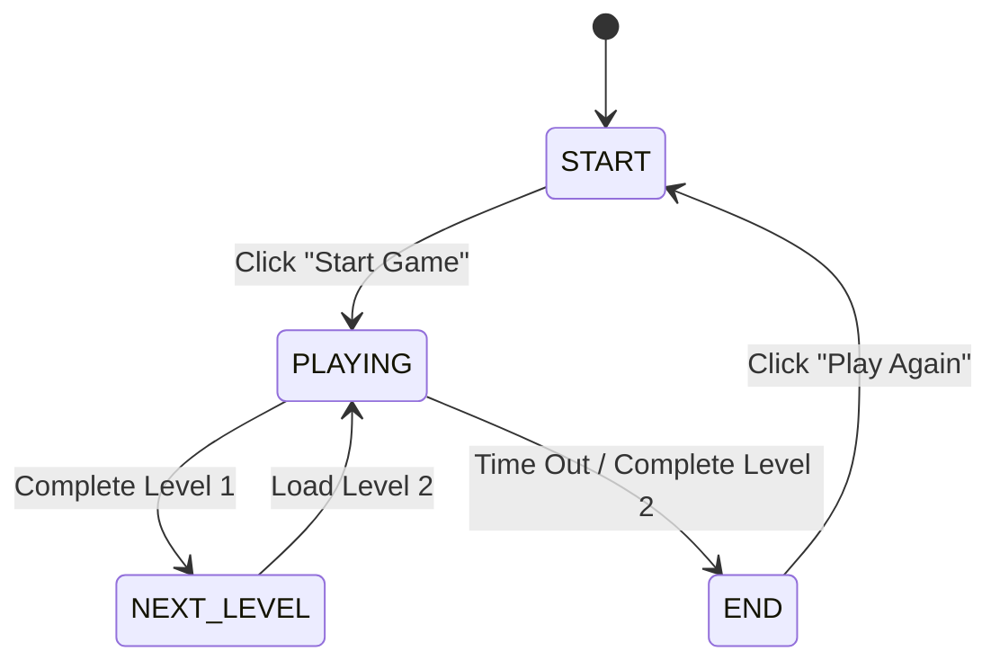

# Specification: Web Game Spot the Difference (จับผิดภาพ)

**Date:** 2026-07-05
**Status:** Approved by User
**Tech Stack:** HTML5, CSS3, Vanilla JavaScript (Single Page Application)

---

## 1. Overview & Purpose
A premium web-based "Spot the Difference" (จับผิดภาพ) game that runs entirely in the browser. Players are presented with two images side-by-side: an original reference image on the left, and a modified image on the right where certain elements have been deleted or altered. The objective is to identify and circle all differences on the right image within a 3-minute time limit per level.

The game will contain 2 levels based on the user's provided images:
- **Level 1 (Elephant Battle):** 8 differences.
- **Level 2 (Forest Boats):** 6 differences.

---

## 2. Project Architecture & File Structure
To keep the application fast, lightweight, and easily deployable (e.g., to GitHub Pages), the project is structured as a zero-dependency vanilla web app:

```text
spot-differences/
├── assets/                          # Game images assets folder
│   ├── original_1.png               # Level 1: Original Image
│   ├── game_1.png                   # Level 1: Image with edits/deletions
│   ├── answer_1.png                 # Level 1: Reference image showing answers
│   ├── original_2.png               # Level 2: Original Image
│   ├── game_2.png                   # Level 2: Image with edits/deletions
│   └── answer_2.png                 # Level 2: Reference image showing answers
├── index.html                       # Core layout and state-container
├── style.css                        # Premium visual style, themes, and animations
├── game.js                          # State management, coordinates checking, and timer
├── .gitignore                       # Git ignore file to exclude DS_Store, etc.
└── README.md                        # Project instructions
```

---

## 3. Game Flow & State Machine
The application behaves as a Single Page Application (SPA), managing three main display states:



### A. Start Screen (หน้าแรก)
- **Design:** Dark, premium theme using glassmorphism card styling and smooth gradient animations.
- **Components:**
  - Game Title: "SPOT THE DIFFERENCE" (จับผิดภาพประวัติศาสตร์)
  - Brief instructions: "⏱️ 3 minutes per level | Find all differences | Tap to circle"
  - Interactive "Start Game" button with a pulse micro-animation.
  - Preview thumbnails of the levels.

### B. Gameplay Screen (หน้าเล่นเกม)
- **Timer:** A countdown timer starting at **03:00 (180 seconds)**. When it reaches 00:00, the game transitions directly to the End Screen.
- **Header:** Shows the current level (e.g., "Level 1/2: Elephant Battle") and progress indicators (e.g., "Differences: 0 / 8").
- **Side-by-Side Images Container:**
  - Left panel: Displays `original_X.png`. Non-interactive, with a small watermark "Original Image".
  - Right panel: Displays `game_X.png`. Interactive crosshair cursor when hovering. Clicking on it registers coordinates.
  - When a correct difference is clicked:
    - Draw a persistent red outline circle (pulsing briefly) on the right image at the match location.
    - Increment the count of differences found.
    - Play success sound or visual check mark flash.
  - When an incorrect click happens:
    - Trigger a subtle visual shake animation on the right panel or show a quick red flash to signify a miss. No time penalty.
- **Level Progression:**
  - When all differences are found (8 for Level 1, 6 for Level 2), automatically load the next level or transition to the End Screen.
  - Include a "Skip Level" button for testing purposes.

### C. End Screen (หน้าสรุปผล)
- **Summary Statistics:**
  - Total score (e.g., "14 / 14 differences found" or lower if time ran out).
  - Time remaining bonus.
  - Rating/Performance badge based on speed and accuracy.
- **Action:** A "Play Again" button that resets all states (score, levels, timers) and returns the user to the Start Screen.

---

## 4. Coordinate Calculation & Responsive Design
To ensure that coordinates map perfectly regardless of screen size (mobile, tablet, desktop, or resizing), the coordinates must be computed as **percentages relative to the image size**, rather than absolute pixels.

### Mathematical Conversion
When a player clicks on the interactive image container:
$$x_{\%} = \frac{ClickX - BoundingBoxLeft}{ImageWidth} \times 100$$
$$y_{\%} = \frac{ClickY - BoundingBoxTop}{ImageHeight} \times 100$$

A click is considered a match if it falls within the radius $r_{\%}$ of a predefined coordinate:
$$\sqrt{(x_{\%} - targetX_{\%})^2 + (y_{\%} - targetY_{\%})^2} \le targetR_{\%}$$

---

## 5. Developer Mode (Calibration Helper Tool) 🛠️
Because exact coordinate maps for the differences do not yet exist, a developer utility is built into the game.

- **Trigger:** Adding `?dev=true` to the URL query string or pressing the keyboard shortcut key `d` during gameplay.
- **Behavior:**
  - Clicking on the interactive image will place a temporary pink indicator circle on the image.
  - It will log the exact JSON format coordinates (`{"x": xx.x, "y": yy.y, "r": 5.0}`) directly to a hidden overlay developer panel.
  - The developer can copy these JSON outputs and paste them into `game.js` configuration.

---

## 6. Git Implementation
The project will be initialized as a git repository immediately inside `/Users/mac/spot-differences/`:
- Create `.gitignore` to ignore system files (`.DS_Store`, etc.) and visual companion folders (`.superpowers`).
- Run `git init`.
- Commit all code elements and assets in logical, clean phases.
